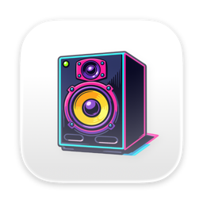

<p align="center">
  
</p>

<h1 align="center">Nommac</h1>

<p align="center">
   Per-output software volume attenuation for macOS.
</p>

<p align="center">
  <a href="https://github.com/pablopunk/nommac/actions/workflows/ci.yml"></a>
  <a href="https://github.com/pablopunk/nommac/releases/latest"></a>
  <a href="LICENSE"></a>
</p>

<p align="center">
  
</p>

Nommac is a tiny native menu-bar app that adds software attenuation after macOS system volume. It solves the awkward gap between muted and still-too-loud speakers **(LIKE THE F\*\*\*ING RAZER NOMMO SPEAKERS THAT REQUIRE RAZER SYNAPSE TO MESS WITH EQ AND ARE NOT SUPPORTED ON MAC)** without taking over output switching.

Each output gets its own setting. So it will remeber the volume you like for each speaker.

## Highlights

- A single minimal slider with up to `-48 dB` of extra attenuation.
- Independent profiles keyed to each output device.
- Automatic tracking of the output already selected by macOS.
- True `0 dB` bypass for every new device.
- Optional launch at login.
- No recording, analytics, network client, or audio stored on disk.
- Universal Apple silicon and Intel build.

## Install

Download the latest signed and notarized build from [GitHub Releases](https://github.com/pablopunk/nommac/releases/latest), open the DMG, and drag Nommac to Applications.

On first use, macOS asks for **Screen & System Audio Recording** permission. Nommac needs it for the Core Audio process tap that applies attenuation; it does not record or retain audio.

Nommac requires macOS 15 or newer. Most physical outputs should work, while Bluetooth, AirPlay, virtual devices, and protected-audio paths may vary with their Core Audio implementation.

## Development

```sh
make test
make run
```

`make build` creates a hardened, Developer ID-signed universal app at `build/Nommac.app`. `make ci-build` produces an ad-hoc signed build without release credentials.

## Release

Push a semantic version tag and GitHub Actions handles the rest:

```sh
git tag v1.0.0
git push origin v1.0.0
```

The release workflow imports the signing certificate into an ephemeral keychain, builds both architectures, signs with hardened runtime, notarizes with Apple, staples the app and DMG, generates checksums, and publishes the artifacts to GitHub Releases.

It expects the repository secrets `APPLE_ID`, `APPLE_APP_SPECIFIC_PASSWORD`, `APPLE_TEAM_ID`, `MACOS_CERT_P12_BASE64`, and `MACOS_CERT_PASSWORD`.

To provision them with the GitHub CLI, fill in `.env.release` from `.env.release.example` and run `make setup-release`.

For a local signed and notarized package, place Apple credentials in `.env.release` and run:

```sh
make release VERSION=1.0.0
```

## Privacy

Read the short [privacy policy](PRIVACY.md). Nommac processes audio only in memory and has no network client.

## License

[MIT](LICENSE) © Pablo Varela
