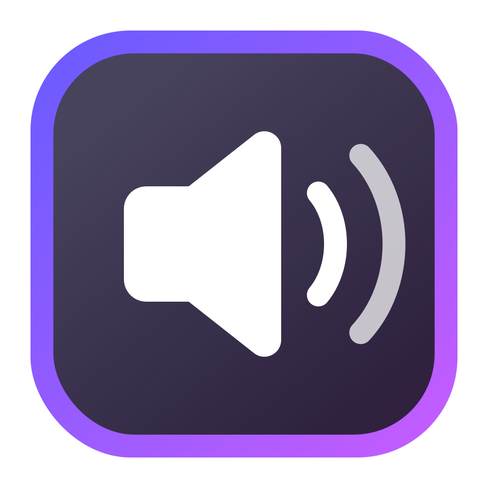

<p align="center">
  
</p>

# Nommac

A tiny native macOS attenuator for the Razer Nommo V2 X.

The Nommo exposes only about `-28 dB` of hardware volume range, making its first audible step too loud in a quiet room. Nommac adds up to `-48 dB` of software attenuation before audio reaches the speakers.

## What it does

- Activates only while macOS has already selected **Razer Nommo V2 X**.
- Never changes the system output, so AirPods and other devices keep using macOS switching.
- Provides one continuous attenuation slider in the menu bar.
- Runs at login when enabled.
- Processes audio in memory with no recording, analytics, or network access.

## Install

Download the latest universal macOS build from [GitHub Releases](https://github.com/pablopunk/nommac/releases), open the DMG, and move Nommac to Applications.

The first launch asks for **Screen & System Audio Recording** permission. macOS uses that permission for the Core Audio process tap that applies the gain adjustment.

Nommac requires macOS 15 or newer and currently targets the Razer Nommo V2 X USB device.

## Development

```sh
make test
make run
```

`make build` creates a hardened, Developer ID-signed universal app at `build/Nommac.app`. Use `make ci-build` for an ad-hoc signed build.

## Release

Releases are built, signed, notarized, stapled, checksummed, and uploaded from a trusted Mac:

```sh
make release VERSION=1.0.0
```

The release script reads Apple notarization credentials from `.env.release`, falling back to `~/src/nvm/.env.release`, and uses the Developer ID Application certificate in Keychain.

## Privacy

See [PRIVACY.md](PRIVACY.md). Nommac has no network client and never stores audio.

## License

[MIT](LICENSE)
