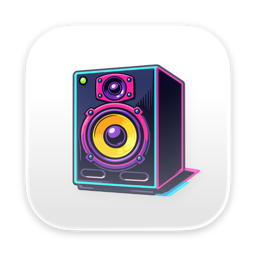

<p align="center">
  
</p>

<h1 align="center">Nommac</h1>

<p align="center">
   Razer Nommo V2 X control panel for macOS. No Synapse required.
</p>

<p align="center">
  <a href="https://github.com/pablopunk/nommac/actions/workflows/ci.yml"></a>
  <a href="https://github.com/pablopunk/nommac/releases/latest"></a>
  <a href="LICENSE"></a>
</p>

Razer's Nommo V2 X speakers hide their EQ, eco mode, and sleep timeout behind Razer Synapse — which does not exist for macOS. Nommac is a tiny native menu-bar app that talks to the speakers directly over USB, so you get every setting Synapse has without Windows, drivers, or bloat.

## Features

- **10-band equalizer** (31 Hz – 16 kHz, ±12 dB) with Flat, Game, Movie, and Music presets.
- **Eco mode toggle** and **auto-sleep timeout** (including *Never* — stop the speakers from sleeping mid-song).
- **Master volume** control.
- Settings are written to the speaker firmware, so they **persist across reboots and re-plugs**.
- Detects the speakers connecting and disconnecting automatically.
- Optional launch at login.
- No permissions, no recording, no analytics, no network. Universal Apple silicon and Intel build.

## Install

Download the latest signed and notarized build from [GitHub Releases](https://github.com/pablopunk/nommac/releases/latest), open the DMG, and drag Nommac to Applications.

Or build from source:

```sh
make run
```

## How it works

The Nommo V2 X exposes a vendor HID interface alongside its USB audio. Nommac speaks Razer's 90-byte feature-report protocol (report ID `0x07`, reverse engineered in [openrazer#2758](https://github.com/openrazer/openrazer/issues/2758)) via IOKit — the same commands Synapse sends on Windows:

| Setting | Command |
|---|---|
| Eco mode | `0x07/0x08` |
| Sleep timeout | `0x07/0x03` (big-endian seconds; firmware quirk: this write re-enables eco, so Nommac restores it) |
| 10-band EQ | `0x08/0x04` (`0x0C` = 0 dB, one unit per dB) |
| EQ preset | `0x08/0x02` (0–3; `0x10` = custom) |
| Master volume | `0x08/0x06` (0–100) |

## CLI

The app binary doubles as a command-line tool. `make install` symlinks it to `~/.local/bin/nommac`:

```sh
nommac status                    # show all settings
nommac eco on|off                # power saving (auto sleep)
nommac sleep 30 | sleep off      # idle sleep timeout in minutes
nommac eq show | eq flat         # current 10-band EQ / reset to 0 dB
nommac eq 4 3 2 0 0 0 0 1 2 3    # set bands: 31 63 125 250 500 1k 2k 4k 8k 16k Hz
nommac preset music              # flat|game|movie|music (resets bands)
nommac volume 42                 # master volume 0-100
```

## Development

```sh
make test      # unit tests (protocol codec)
make build     # signed .app bundle in build/
make install   # copy to ~/Applications
make release   # tag-driven signed + notarized release
```

## License

[MIT](LICENSE)
